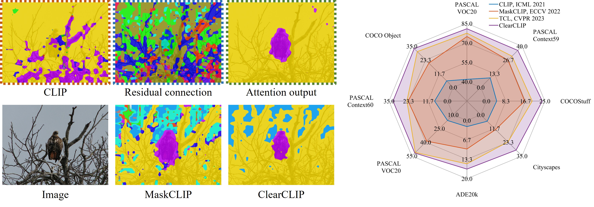
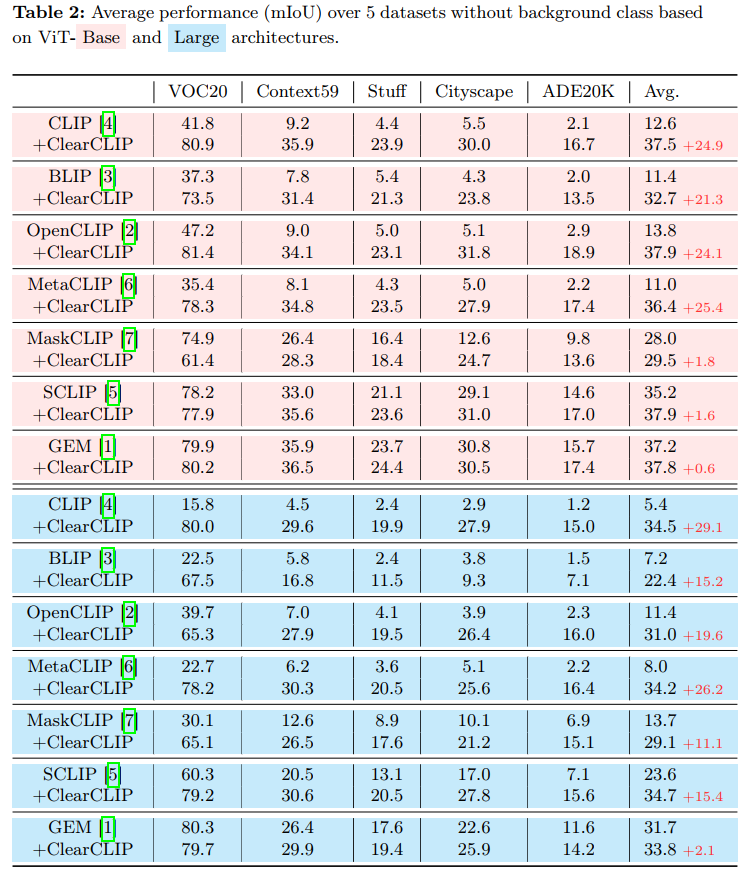

<div align="center">

<h1>ClearCLIP: Decomposing CLIP Representations for Dense Vision-Language Inference</h1>

<div>
    <a href='https://mc-lan.github.io/' target='_blank'>Mengcheng Lan</a><sup>1</sup>&emsp;
    <a href='https://chaofengc.github.io/' target='_blank'>Chaofeng Chen</a><sup>1</sup>&emsp;
    <a href='https://keyiping.wixsite.com/index' target='_blank'>Yiping Ke</a><sup>2</sup>&emsp;
    <a href='https://scholar.google.com.hk/citations?user=q4lnWaoAAAAJ&hl=en&inst=8669986779262753491&oi=ao' target='_blank'>Xinjiang Wang</a><sup>3</sup>&emsp;
    <a href='https://scholar.google.com.hk/citations?user=PnNAAasAAAAJ&hl=en' target='_blank'>Litong Feng</a><sup>3</sup>&emsp;
    <a href='https://www.statfe.com/' target='_blank'>Wayne Zhang</a><sup>3</sup>&emsp;
</div>
<div>
    <sup>1</sup>S-Lab, Nanyang Technological University&emsp; 
    <sup>2</sup>CCDS, Nanyang Technological University&emsp; 
    <sup>3</sup>SenseTime Research&emsp;
</div>

<div>
    <strong>Accepted to ECCV 2024</strong>
</div>

<div>
    <h4 align="center">
        • <a href="https://arxiv.org/abs/2407.12442" target='_blank'>[arXiv]</a> •
    </h4>
</div>



</div>

## Abstract
> *Despite the success of large-scale pretrained Vision-Language Models (VLMs) especially CLIP in various open-vocabulary tasks, their application to semantic segmentation remains challenging, producing noisy segmentation maps with mis-segmented regions. In this paper, we carefully re-investigate the architecture of CLIP, and identify residual connections as the primary source of noise that degrades segmentation quality. With a comparative analysis of statistical properties in the residual connection and the attention output across different pretrained models, we discover that CLIP's image-text contrastive training paradigm emphasizes global features at the expense of local discriminability, leading to noisy segmentation results. In response, we propose ClearCLIP, a novel approach that decomposes CLIP's representations to enhance open-vocabulary semantic segmentation. We introduce three simple modifications to the final layer: removing the residual connection, implementing the self-self attention, and discarding the feed-forward network. ClearCLIP consistently generates clearer and more accurate segmentation maps and outperforms existing approaches across multiple benchmarks, affirming the significance of our discoveries.*

## Dependencies and Installation


```
# git clone this repository
git clone https://github.com/mc-lan/ClearCLIP.git
cd ClearCLIP

# create new anaconda env
conda create -n ClearCLIP python=3.10
conda activate ClearCLIP

# install torch and dependencies
pip install -r requirements.txt
```


## Datasets
We include the following dataset configurations in this repo: 
1) `With background class`: PASCAL VOC, PASCAL Context, Cityscapes, ADE20k, and COCO-Stuff164k, 
2) `Without background class`: VOC20, Context59 (i.e., PASCAL VOC and PASCAL Context without the background category), and COCO-Object.

Please follow the [MMSeg data preparation document](https://github.com/open-mmlab/mmsegmentation/blob/main/docs/en/user_guides/2_dataset_prepare.md) to download and pre-process the datasets. 
The COCO-Object dataset can be converted from COCO-Stuff164k by executing the following command:

```
python datasets/cvt_coco_object.py PATH_TO_COCO_STUFF164K -o PATH_TO_COCO164K
```


## Quick Inference
```
python demo.py
```


## Model evaluation
Single-GPU:

```
python eval.py --config ./config/cfg_DATASET.py --workdir YOUR_WORK_DIR
```

Multi-GPU:
```
bash ./dist_test.sh ./config/cfg_DATASET.py
```

Evaluation on all datasets:
```
python eval_all.py
```
Results will be saved in `results.xlsx`.

We provide the comparison results (in Appendix) on five datasets without background class by using our implementation as below:

<div>

</div>


## Citation

```
@inproceedings{lan2024clearclip,
      title={ClearCLIP: Decomposing CLIP Representations for Dense Vision-Language Inference}, 
      author={Mengcheng Lan and Chaofeng Chen and Yiping Ke and Xinjiang Wang and Litong Feng and Wayne Zhang},
      booktitle={ECCV},
      year={2024},
}
```

## License
This project is licensed under <a rel="license" href="https://github.com/mc-lan/SmooSeg/blob/master/LICENSE">NTU S-Lab License 1.0</a>. Redistribution and use should follow this license.


## Acknowledgement
This study is supported under the RIE2020 Industry Align- ment Fund – Industry Collaboration Projects (IAF-ICP) Funding Initiative, as well as cash and in-kind contribution from the industry partner(s).

This implementation is based on [OpenCLIP](https://github.com/mlfoundations/open_clip) and [SCLIP](https://github.com/wangf3014/SCLIP). Thanks for the awesome work.

## Contact
If you have any questions, please feel free to reach out at `lanm0002@e.ntu.edu.sg`.
